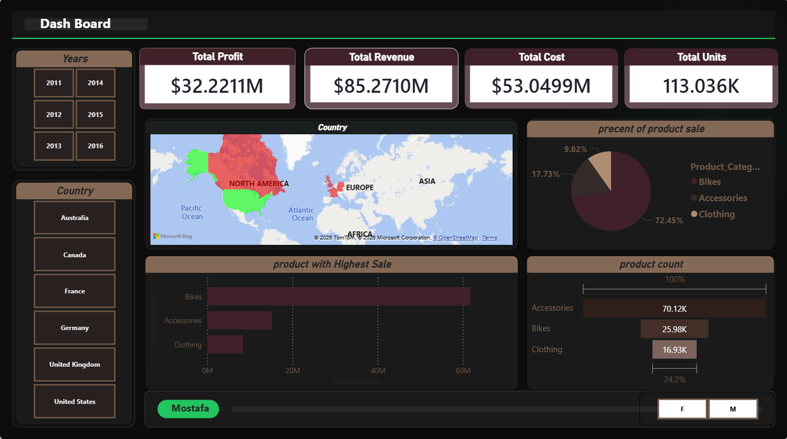

# 🚲 Bikers Performance & Sales Analytics Dashboard

## 📌 Project Overview
An interactive Power BI dashboard designed to analyze and audit bicycle sales and operational performance across multiple years. This project focuses on delivering business intelligence insights for revenue growth, seasonality tracking, and inventory control.

## 📊 Dashboard Preview

## 🛠️ Project Structure & Tech Stack
- **Core Report:** `Bikers power bi.pbix` (Power BI Desktop)
- **Data Source:** `Data/Sales.xlsx` (Cleaned & transformed via Power Query)
- **UI/UX Customization:** Custom `Design_assets/Theme.json` for color palette and customized layout backgrounds designed via PowerPoint.

## 🔍 Key Features & Analytics Focus
- **Data Transformation (ETL):** Handled missing data, type casting, and date formatting using Power Query to build a clean data model.
- **Custom UI/UX:** Built a professional dark-themed layout to enhance readability and user engagement.
- **Advanced Calculations:** Developed custom DAX measures to track sales distribution and seasonal peak hours.
